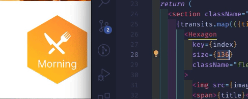
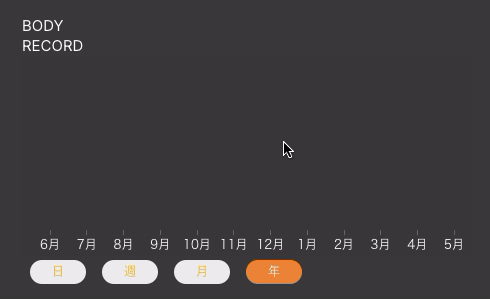
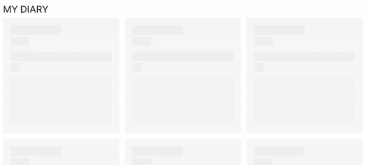
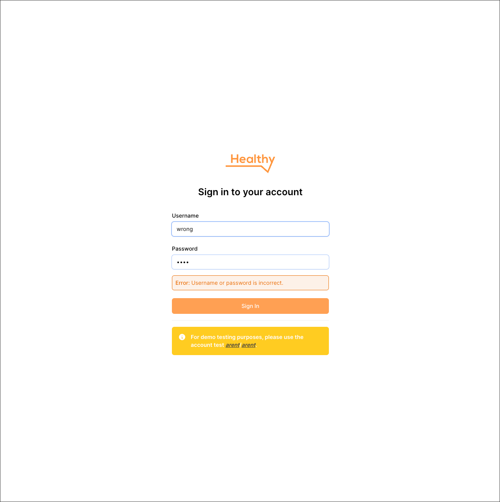
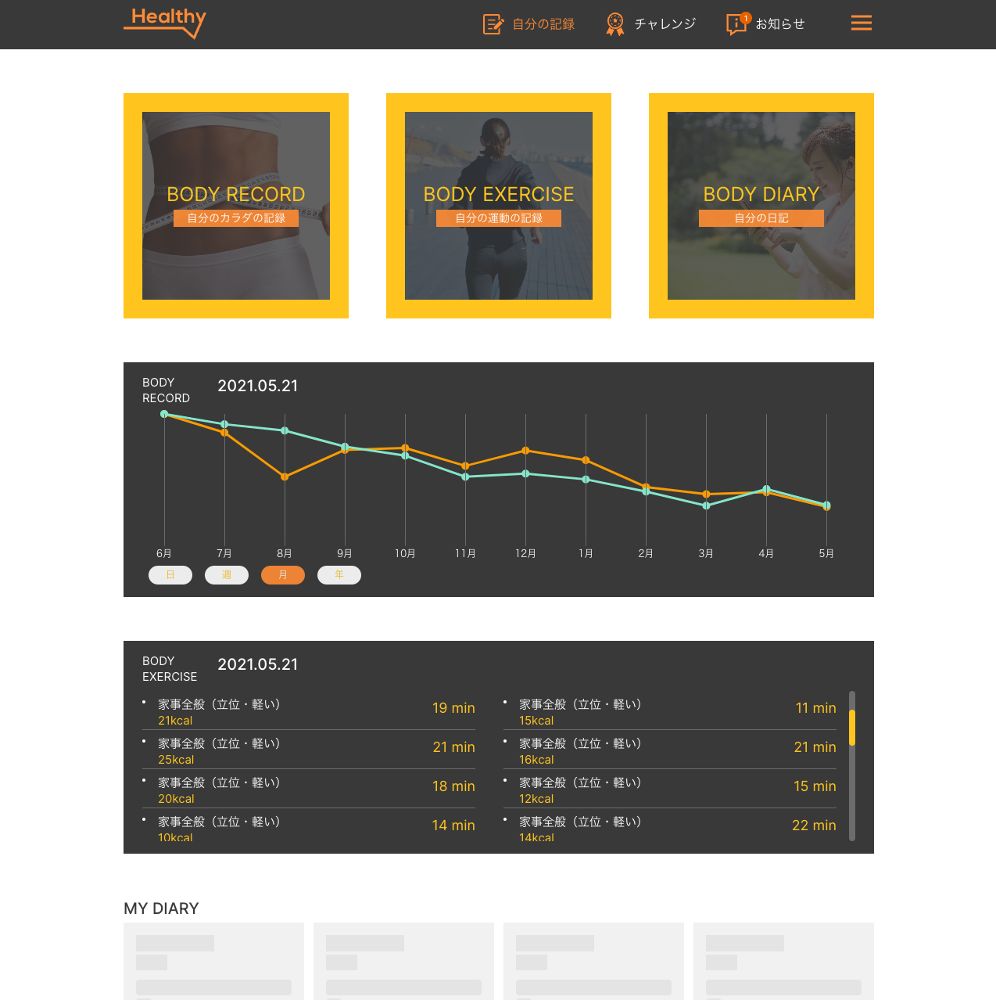

# Arent Interview

> A web application for health care. https://arent-interview.vercel.app

## Video demo

[](https://youtu.be/MVgHSQEheW8)

## Getting Started

First, run the development server:

```bash
npm run dev
```

Open `http://localhost:3000` with your browser to see the result.

## Overview

TODO

## Execution time

TODO

## Rest Mock API

TODO

## Highlight (out of scope)

| Component          | Description                                                  |                             Screenshot                              |
| :----------------- | :----------------------------------------------------------- | :-----------------------------------------------------------------: |
| Percentage         | Support dynamic value and animation                          |                 |
| Hexagon            | Support dynamic size                                         |              |
| Beautify Chart     | Dynamic chart, tooltip, period                               |                |
| Responsive         | Ensure that all pages are mobile-friendly                    |    [View](https://youtu.be/MVgHSQEheW8?si=RHjEwbtZFTGSDRl2&t=95)    |
| Load more          | Support load more                                            |    [View](https://youtu.be/MVgHSQEheW8?si=RHjEwbtZFTGSDRl2&t=36)    |
| Skeleton           | A skeleton screen is an animated placeholder                 |             |
| Sign-in `/sign-in` | To successfully log in, use the account test `arent`/`arent` |  |
| Logout `/logout`   | Helpful to retest `/sign-in` functionality                   |                                                                     |

## Tech stack

- Tailwindcss
- ECharts
- React-hook-form
- Redaxios (same api as Axios)
- React Server Components
- CI/CD for deploy and check code quality (ESLint + Typescript)

# Screenshots



## License

Unlicense
