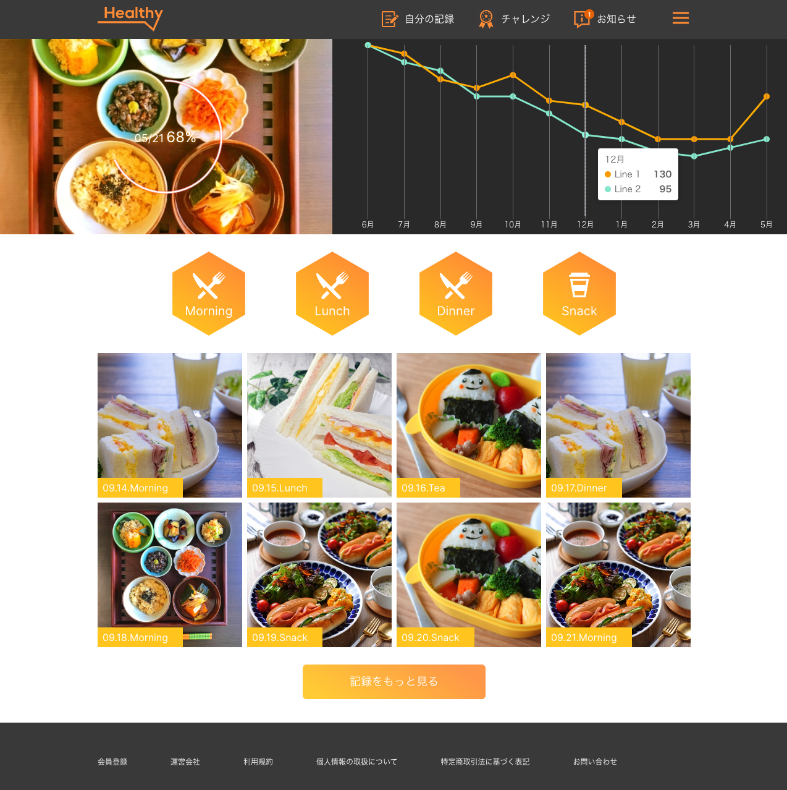

# Arent Interview

> A web application for health care. https://arent-interview.vercel.app

## Video Demo

[](https://youtu.be/MVgHSQEheW8)

## Getting Started

First, run the development server:

```bash
npm run dev
```

Open `http://localhost:3000` with your browser to see the result.

## Overview

This is a test that requires implementing front-end development based on a Figma design.  
So there are 3 main pages: `/account/top`, `/account/record`, and `/columns`(public anyone).

In addition, there are `/sign-in` and `/logout` pages to simulate the authentication feature.

> [!NOTE]  
> For demo testing purposes, please use the account test `arent`/`arent`.

The application is built using Next.js with built-in API support. It has minimal dependencies, and the primary technology used for UI development is Tailwind CSS, which allows for unlimited UI customization. Additionally, ESLint, Prettier, and TypeScript are integrated to ensure the highest code quality.

## Testing Hour `(12h)`

It takes `8 hours` to complete the requirements of the test.  
And about `4 hours` for advanced features out of scope the test such as Mock API, authentication, load more, skeleton, and specifically documenting the `README.md`.

## Rest Mock API

Base URL `https://arent-interview.vercel.app/api`.

### Top page

> [/v1/top/rate](https://arent-interview.vercel.app/api/v1/top/rate)  
> [/v1/top/graph](https://arent-interview.vercel.app/api/v1/top/graph)  
> [/v1/top/meals?page=2](https://arent-interview.vercel.app/api/v1/top/meals?page=2)

### My record

> [/v1/record/graph](https://arent-interview.vercel.app/api/v1/record/graph)  
> [/v1/record/exercise](https://arent-interview.vercel.app/api/v1/record/exercise)  
> [/v1/record/diaries?page=2](https://arent-interview.vercel.app/api/v1/record/diaries?page=2)

### Column page

> [/v1/column/blogs?page=2](https://arent-interview.vercel.app/api/v1/column/blogs?page=2)

## Highlight (out of scope)

| Component          | Description                                                  |                             Screenshot                              |
| :----------------- | :----------------------------------------------------------- | :-----------------------------------------------------------------: |
| Percentage         | Support dynamic value and animation                          |                 |
| Hexagon            | Support dynamic size                                         |              |
| Beautify Chart     | Dynamic chart, tooltip, period                               |                |
| Responsive         | Ensure that all pages are mobile-friendly                    |    [View](https://youtu.be/MVgHSQEheW8?si=RHjEwbtZFTGSDRl2&t=95)    |
| Load more          | Support load more                                            |    [View](https://youtu.be/MVgHSQEheW8?si=RHjEwbtZFTGSDRl2&t=36)    |
| Skeleton           | A skeleton screen is an animated placeholder                 |             |
| Sign-in `/sign-in` | To successfully log in, use the account test `arent`/`arent` |  |
| Logout `/logout`   | Helpful to retest `/sign-in` functionality                   |                                                                     |

## Tech Stack

- Tailwindcss
- ECharts
- React-hook-form
- Redaxios (same api as Axios)
- React Server Components
- CI/CD for deploy and check code quality (ESLint + Typescript)

## Screenshots



## License

Unlicense
